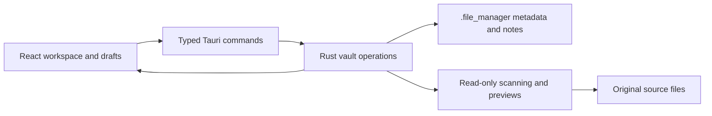

# File Manager architecture

File Manager is an offline Windows desktop application that adds metadata and reading notes to existing resource folders. [README.md](README.md) explains usage and quick-start commands. This document introduces the architecture and links to the authoritative technical contracts.

## Scope and invariants

A vault extends an ordinary writable local Windows resource folder. The application reads originals; it never creates, renames, moves, deletes, or rewrites them. Launching their default applications is explicit and external to this boundary. All vault-specific application writes, including the WebView2 profile, stay below root `.file_manager`. No AppData preferences, telemetry, cloud service, or network source lookup is used. Complete HTTP(S) source URLs open in the default browser.

Each process owns one vault; independent vaults can run concurrently. Rust owns storage and mutations, while React owns presentation and unsaved drafts. Source metadata and notes save independently. Manual refresh hashes every source and reconciles file identity conservatively. Missing sources retain their knowledge.

## System structure

- **Frontend:** React and TypeScript under `src/`; `boot.tsx` mounts `app/App.tsx`. Feature folders contain sources, notes, tags, and viewers; shared domain models, native integration, controls, and styles have separate homes.
- **Native backend:** Tauri and Rust under `src-tauri/src/`; typed commands dispatch vault operations off the native event loop. Scanning, persistence, startup, and process handoff have explicit owners.
- **Vault storage:** A manifest, JSONL registries, and UUID-named Markdown note bodies under `.file_manager`. A single-writer lock and replayable journal protect persistence.
- **Development tools:** Scripts generate assets and example vaults, export contract fixtures, verify the native app, and stage portable packages.

Dependencies flow from app orchestration to features and shared modules. Shared UI and domain modules do not import the app coordinator. The application uses one serialized vault consistency boundary; a database, global state framework, and generic repository abstraction are not required by the current scope.

## Technical documentation

| Document                           | Authoritative responsibility                                                                             |
| ---------------------------------- | -------------------------------------------------------------------------------------------------------- |
| [Metadata](docs/metadata.md)       | Storage schema, entities, timestamp semantics, and derived file facts.                                   |
| [Persistence](docs/persistence.md) | Native module ownership, vault startup/switching, refresh identity, locking, transactions, and recovery. |
| [Frontend](docs/frontend.md)       | Frontend ownership, IPC boundary, drafts, guarded transitions, and modal lifecycle.                      |
| [Interface](docs/interface.md)     | Panels, controls, resizing, source viewers, zoom, and content policy.                                    |
| [Development](docs/development.md) | Setup, tracked files, checks, contract verification, fixtures, packaging, and documentation maintenance. |

## Deliberate limits

- Windows 11 and ordinary local writable folders; no cloud/network-vault concurrency guarantees.
- Full hashing on every refresh; no hash cache, cancel/resume job framework, or watcher.
- One serialized vault lock; PDF reads may wait behind hashing, while native window controls remain responsive.
- Whole-registry journal writes and per-snapshot note-size observation remain unchanged. Measure representative vaults before changing either.
- No database, metadata migration, source deletion, search/filtering, reconnect, cross-source notes, import/export, backups/history/trash UI, or synchronization.
- External JSONL modifications require reopening. External Markdown body edits intentionally have no conflict check.
- OS reads may affect access times. No intentional source timestamp changes. Durability is recovery-oriented and does not defeat malicious concurrent path replacement or faulty storage hardware.
- Window position/size, panel widths, and selection are not persisted; optional recent tag history is the only UI history here.
